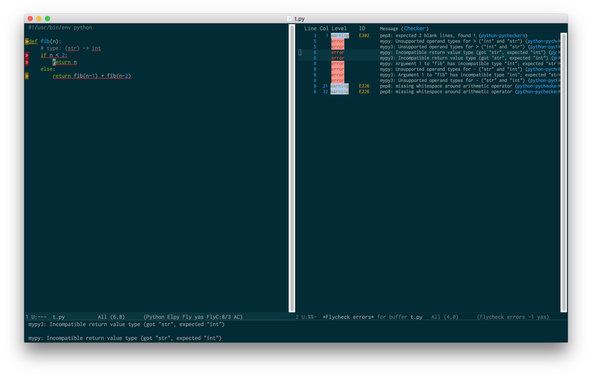
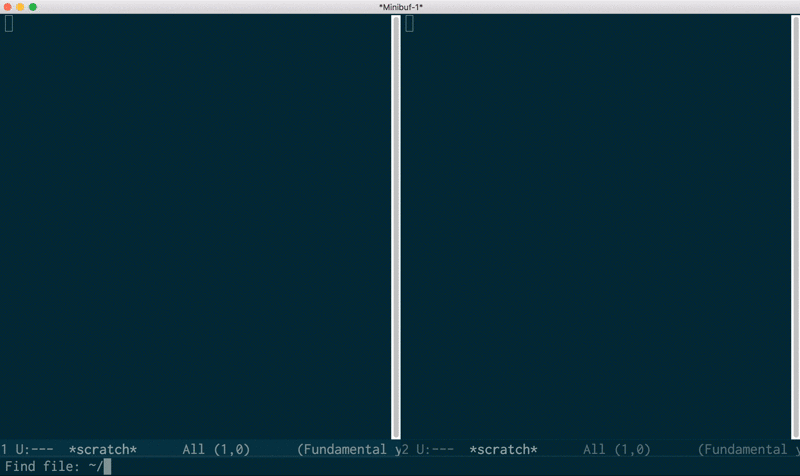

[](https://melpa.org/#/flycheck-pycheckers)
[](https://stable.melpa.org/#/flycheck-pycheckers)

# flycheck-pycheckers
Multiple syntax checker for Python in Emacs, using
[Flycheck](http://www.flycheck.org)

Copyright Marc Sherry <msherry@gmail.com>

This package provides a way to run multiple syntax checkers on Python code,
in parallel.  The list of supported checkers includes:

- [pylint](https://www.pylint.org/)
- [pylint-py3k](https://www.pylint.org/) (Command: pylint --py3k)
- [pylint3](https://www.pylint.org/)
- [flake8](http://flake8.pycqa.org/)
- [pep8](https://www.python.org/dev/peps/pep-0008/)
- [pyflakes](https://github.com/PyCQA/pyflakes)
- [mypy](http://mypy-lang.org/) (for both Python 2 and 3)
- [bandit](https://github.com/PyCQA/bandit)

This is an alternative way of running multiple Python syntax checkers in
Flycheck that doesn't depend on Flycheck's chaining mechanism.

Flycheck is [opinionated](https://github.com/flycheck/flycheck/issues/185)
about what checkers should be run, and chaining is difficult to get right
(e.g. see https://github.com/flycheck/flycheck/issues/836,
https://github.com/flycheck/flycheck/issues/1300).  This package assumes that
the user knows what they want, and can configure their checkers accordingly --
if they want to run both flake8 and pylint, that's fine.

This also allows us to run multiple syntax checkers in parallel, rather than
sequentially.

## Quick start

Installation via MELPA is easiest:

```elisp
M-x package-install <RET> flycheck-pycheckers <RET>
```

Then, in your `init.el`:

```elisp
(global-flycheck-mode 1)
(with-eval-after-load 'flycheck
  (add-hook 'flycheck-mode-hook #'flycheck-pycheckers-setup))
```

Start editing a Python file!

For more details on using Flycheck in general, please see
http://www.flycheck.org/en/latest/user/quickstart.html.  The error list
(viewable with `flycheck-list-errors`, bound to <kbd>C-c ! l</kbd> by default) shows
a unified view of all errors found by all checkers, with line and column
information where available.



flycheck-pycheckers can run over any Python file right away, without needing to
set up virtual environments or driver scripts.  You will simply need to ensure
that the checkers you want to run (pep8, mypy, flake8, etc.) are installed
somewhere on your PATH where Emacs can find them.



## Alternatives:

* [Other Flycheck-based
  checkers](http://www.flycheck.org/en/latest/languages.html#python) -- Some
  are officially part of the Flycheck package, and some (like this one) are
  external plugins.
* [Flymake](https://www.emacswiki.org/emacs/FlyMake) -- Flymake is an older
  syntax-checking minor mode for Emacs, and is generally less supported and
  featureful than Flycheck.

## Configuration options

_You can use this package without needing to get into these details at first
-- they are intended for power users and those needing more customization._

There are a number of options that can be customized via
`customize-variable`, which all start with `flycheck-pycheckers-`.  These
include:

* `flycheck-pycheckers-args` - general arguments to pass to `pycheckers.py`.
* `flycheck-pycheckers-checkers` - the set of checkers to run (pylint, pep8,
   mypy, etc.).  Can be set in `.pycheckers` files with the variable
   `checkers` as a comma-separated list of checker names.
* `flycheck-pycheckers-ignore-codes` - a set of error codes to universally
  ignore.  These can be set more granularly (e.g. per-project) using the
  `.pycheckers` file described below.
* `flycheck-pycheckers-max-line-length` - the default maximum line
  length.  Can be overridden via `.pycheckers` file.
* `flycheck-pycheckers-multi-thread` - whether to run each checker
  simultaneously in its own thread, for performance.
* `flycheck-pycheckers-venv-root` - a directory containing Python virtual
  environments, so that imports may be found.

Additionally, a `.pycheckers` file may be created in a directory to control
options for every file under this directory.  These files may be logically
combined, so a project may have one set of options that may be selectively
overridden in a specific subdirectory.

### Example .pycheckers file:

    [DEFAULT]
    max_line_length = 120
    mypy_config_file = ci/mypy.ini

Variables that can be set in the configuration file include the following.
Note that these are implemented as modifying the values received by
`argparse` in the `pycheckers.py` script, so running `bin/pycheckers.py
--help` is a good way to find other options that may be specified.

* <*checker*\>_command - a customized command for running a given checker. For
  example, if you work at a company that provides its own driver script/daemon
  for running `mypy`, give the path to the daemon here as `mypy_command =
  /usr/local/bin/mypy-daemon`.
* `max-line-length` - the maximum allowable line-length.  This is a good
  option to place in a project-specific directory if you have a personal
  line length preference set by default via
  `flycheck-pycheckers-max-line-length`, but also work on projects that
  follow different standards.
* `checkers` - a comma-separated list of checkers to be run for files under
  this directory.  If, for instance, pep8 should not be run on a directory of
  auto-generated code, this option can accomplish that.
* `ignore_codes` - a comma-separated list of error/warning codes to ignore
  for files under this directory.  Replaces the current set of codes
  completely.
* `merge_configs` - whether to keep traversing upwards when parsing
  `.pycheckers` files, or stop at this one.
* `extra_ignore_codes` - a comma-separated list of error/warning codes to
  add to the current set of ignored errors.  This can be used to make
  certain directories conform to different levels of syntax enforcement.
  For example, a directory containing auto-generated code may omit various
  warnings about indentation or code style.
* `pylint_rcfile` - the location of a project-specific configuration file
  for pylint, pylint-py3k, pylint3
* `mypy_config_file` - the location of a project-specific configuration file
  for mypy
* `flake8_config_file` - the location of a project-specific configuration file
  for flake8


---
Converted from `flycheck-pycheckers.el` by [*el2markdown*](https://github.com/Lindydancer/el2markdown).
